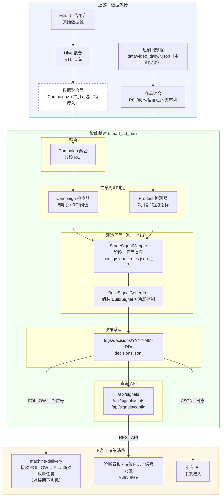

# 智能广告基建系统 产品需求文档
> 版本 v4.0 · 面向开发 · 紧凑格式
## 一、版本信息
| 项目 | 内容 |
|---|---|
| 版本号 | 4.0 |
| 创建日期 | 2026-04-16 |
| 更新日期 | 2026-09-01 |
| 文档状态 | 进行中 |
## 二、变更日志
| 时间 | 变更人 | 主要变更内容 |
|---|---|---|
| 2026-04-17 | @咖灰 | 初版需求 |
| 2026-04-20 | @AI助手 | 细化生命周期判定逻辑、策略引擎设计、前端页面功能 |
| 2026-04-21 | @AI助手 | 基于ROI数据分析重构生命周期定义，替换旧的cost-based阈值 |
| 2026-08-19 | @AI助手 | 新增「跟投决策输出」模块：与 machine-delivery 对齐，盈利/成长/稳定阶段产出 `FOLLOW_UP` 跟投信号；新增信号字段契约与阶段→跟投映射；素材级跟投本期不实现 |
| 2026-09-01 | @AI助手 | 落地信号机制：删除策略引擎与调整类动作，决策端本期唯一产出 `FOLLOW_UP` 建造信号；新增信号模块（BuildSignal/映射/冷却）、pipeline 脚本、`/api/signals` 查询 API；前端移除策略配置页，看板与决策日志对齐信号契约 |
| 2026-09-01 | @AI助手 | 补入 §5.1 领域模型：在线原型链接 + v4.0 mermaid 架构图（源自 v1.0，同步 docs/architecture.md）|
## 三、文档说明
### 3.1 名词解释
| 术语 | 说明 |
|---|---|
| 基建 | 广告投放中的"创建广告、复制广告、调整预算"等基础运营动作 |
| 生命周期 | 商品或广告从上线到衰退的全过程阶段 |
| ROI | Return On Investment，投资回报率 = 收入 / 成本 |
| 冷启动 | 新广告上线后能否持续消耗并产生回报的阶段 |
| 决策 | 系统输出的"应该做什么"的判断，不是实际执行动作 |
| 饱和攻击 | 短时间内大量创建广告，争取曝光的策略 |
| 跟投 | 判定某目标（短剧/Campaign/素材）值得继续投放后，交由下游新建放量任务的机制 |
| 跟投信号 | 智能基建向 machine-delivery 输出的 `FOLLOW_UP` 信号，是跟投触发的唯一入口 |
| 信号契约 | 跟投信号各字段的定义与取值约定，作为两系统对接时的设计依据 |
### 3.2 术语 / 缩略词
| 缩略词 | 全称 | 说明 |
|---|---|---|
| Product | 商品 | 指短剧/内容商品 |
| Campaign | 广告单元 | 广告投放计划 |
| ROI | Return On Investment | 投资回报率 = (d0_order_amt + d0_ad_amt) / cost |
| CTR | Click Through Rate | 点击率 |
| CPA | Cost Per Action | 每次转化成本 |
| d0_order_amt | D0订单收入 | 用户付费订单金额 |
| d0_ad_amt | D0广告收入 | 广告分成收入 |
| machine-delivery | 机器投放系统 | 下游触发编排层，接收跟投信号 → 新建自动化放量任务 |
## 四、需求背景
### 4.1 业务问题
当前广告投放中，"基建工作"面临三大痛点：
| 痛点 | 表现 | 影响 |
|---|---|---|
| 被动响应 | 优化师在广告效果衰减后才开始补充新广告 | 预算浪费、效果下滑 |
| 经验依赖 | 何时新建、复制多少、启用哪些素材，依赖个人经验 | 决策质量参差不齐 |
| 效率瓶颈 | 批量创建工具存在，但"创建什么"仍需人工决策 | 人效低 |
### 4.2 解决方案
智能基建系统将"人工定期批量创建"升级为"系统实时自动耕作"。
**核心定位**：系统作为**广告投放指挥官**，只输出决策，不实际执行。
**关键发现**（基于数据分析）：
- 收入 = d0_order_amt + d0_ad_amt
- **盈利标准：ROI > 40%**
- 盈利Campaign的订单收入占比 > 90%，广告只是放大器
- **72小时是判断Campaign生死的关键节点**
### 4.3 系统定位（v4.0 新增）
智能基建是**决策端**，本期**唯一产出**是跟投信号 `FOLLOW_UP`：
| 产物 | 语义 | 下游 |
|---|---|---|
| 跟投信号 `FOLLOW_UP` | 判定目标值得继续投 → 新建放量任务 | machine-delivery |
生命周期管理动作（加预算/关停/复制等）本期**不实现**——执行决策归属 machine-delivery；信号**不带规模**（放量规模由下游模板承载）。
> 术语对齐：本系统内产品/广告单元/素材三档目标；对外信号中目标维度统一取 `product` / `campaign` / `material`（与 machine-delivery 对齐，避免 ad_unit 与 campaign 混用）。
### 4.4 预期收益
| 指标维度 | 预期效果 | 对应目标 |
|---|---|---|
| 基建效率 | 优化师人均管理广告数提升 200%+ | 提高人效 |
| 基建成功率 | 新广告渡过冷启动期成功率提升 30% | 优化投放表现 |
| 账户健康度 | 衰退期广告占比降低，成长期广告占比提升 | 优化投放表现 |
| 素材利用率 | 优质素材利用周期延长，库存周转率提升 50% | 降本增效 |
| 跟投及时性 | 值得放量的目标自动拉起放量任务，无需人工盯数据 | 自动化投放链路闭环 |
## 五、功能详细说明
### 5.1 领域模型（原型与架构）
**在线原型**：https://gar-su.github.io/smart_ad_put/
**系统架构**（v4.0 信号机制）：



**架构要点**：
- 决策端本期唯一产出 `FOLLOW_UP` 建造信号，不实际执行；放量执行归属 machine-delivery（对接期不实现，见 §5.5.3）
- 主链路：生命周期判定 → 阶段→信号映射（`config/signal_rules.json` 注入）→ 生成器（冷却控制）→ JSONL 落盘（见 §5.8.2）
- 策略引擎已于 v4.0 移除；映射与冷却为单文件可配置（见 §5.5.2）
### 5.1.1 模块总览
| 模块 | 功能清单 |
|---|---|
| 生命周期判定 | 商品生命周期检测、Campaign生命周期检测、阶段说明查询、阈值配置 |
| 建造信号输出 | FOLLOW_UP 信号生成、阶段→信号映射、冷却控制、信号落盘（映射与冷却可配置，见 §5.3~§5.5）|
| 信号查询 API | `/api/signals` 信号查询、`/api/signals/stats` 统计、`/api/signals/config` 配置读写、dashboard 汇总（见 §5.4） |
| 诊断看板 | 健康度总览、生命周期分布、信号类型分布、效率趋势、信号摘要 |
| 决策日志 | 信号列表查询、信号详情查看 |
### 5.2 生命周期判定
**功能描述**：根据广告实体的ROI数据，自动判断其所处的生命周期阶段。
**核心指标**：
```
收入 = d0_order_amt + d0_ad_amt
ROI = 收入 / 成本
盈利标准 = ROI > 40%
```
**关键数据发现**：
- 72小时是判断Campaign生死的关键节点
- 前24h ROI < 10% 的Campaign，85%最终无法盈利
- 盈利Campaign的订单收入占比 > 90%
- 49%的存活>7天的Campaign能盈利
**Campaign生命周期阶段（基于ROI）**：
| 阶段 | 判定条件 | 数据依据 | 精确率 | 运营建议 |
|---|---|---|---|---|
| 待观察 | 投放 < 24h | 时间不足，无法判断 | 0.50 | 等待 |
| 冷死亡 | 投放 > 72h 且从未产生收入 | 24.3%的Campaign从未产生收入 | 0.95 | 直接放弃 |
| 冷启动 | 前24h ROI < 10% | 前24h低ROI的85%最终不盈利 | 0.85 | 观察，24h决策 |
| 验证期 | 24-72h ROI在10-40% | 关键决策点，过了的30%能盈利 | 0.75 | 持续观察 |
| 成长期 | 72h后 ROI > 40% | 92%的这类Campaign保持盈利 | 0.85 | 加预算 |
| 持续盈利 | ROI > 40% 超过7天 | 97%最终盈利 | 0.90 | 重点维护 |
| 衰退期 | ROI从高点下降 > 50% | 后期ROI显著下降 | 0.85 | 准备替代 |
| 关停期 | ROI < 10% 持续72h+ | 几乎无法翻盘 | 0.90 | 关停 |
**商品（ShortPlay）生命周期阶段（基于回测数据验证）**：
判定逻辑基于时间段 + ROI指标组合，时间段划分如下：
| 时间段 | 阶段 | 判定条件 | 精确率 |
|---|---|---|---|
| < 3天 | 待观察 | 时间不足，无法判断 | - |
| 3-7天 | 入场期 | 近3天ROI均值 > 40% | 87% |
| 3-7天 | 退出期 | 近3天ROI均值 < 10% | 85% |
| 7-14天 | 衰退期 | ROI下滑 > 30% | 80% |
| 7-14天 | 成长期 | ROI > 40% 且近3天均值 > 前3天均值 × 1.2（上升20%） | 87% |
| 7-14天 | 稳定期 | ROI > 40% 但趋势平稳 | 86% |
| > 14天 | 退出期 | ROI < 10% 持续5天 | 85% |
| > 14天 | 衰退期 | ROI下滑 > 30% | 80% |
| > 14天 | 成长期 | ROI > 40% 且趋势上升 | 87% |
| > 14天 | 稳定期 | 近5天ROI都在30%-80% | 86% |
**趋势指标定义**：
`recent_roi_history` 是每日 ROI 序列（oldest-first，最早日期在 index 0）。所有指标均基于此序列计算。
| 指标 | 计算 | 含义 |
|---|---|---|
| 近3天ROI均值 | `avg(h[-3:])` | 当前最近的投放表现 |
| 前3天ROI均值 | `avg(h[-6:-3])` | 上一段基准，用于对比趋势 |
| 前半段均值 | `avg(h[:mid])` | 历史前半段的表现水平 |
| 后半段均值 | `avg(h[mid:])` | 历史后半段的表现水平 |
| 趋势上升 | `近3天 > 前3天 × 1.2` | 近期显著改善（+20%），→ GROWTH |
| 趋势下滑 | `(前半段 - 后半段) / 前半段 > 30%` | 整体产出持续走弱，→ DECLINE |
| 稳定波动 | 全部近5天 ROI ∈ [30%, 80%] | 无显著趋势，盈利区间内震荡，→ SUSTAINED |
**Campaign 维度的类趋势指标**（基于分段 ROI 而非日序列）：
| 指标 | 计算 | 含义 |
|---|---|---|
| 后期走强 | `roi_72plus > roi_0_24h × 1.5` | 72h后ROI显著优于前24h，→ GROWTH |
| 后期走弱 | `roi_72plus < roi_0_24h × 0.5` | 72h后ROI衰减至早期一半以下，→ DECLINE |
| 从峰值跌落 | `roi < peak × 0.5` | 当前ROI不足峰值一半，→ DECLINE |
**Campaign 输入参数**：
| 参数 | 类型 | 说明 |
|---|---|---|
| entity_id | string | Campaign唯一标识 |
| duration_hours | float | 投放时长（小时） |
| revenue | float | 总收入 (d0_order_amt + d0_ad_amt) |
| cost | float | 总成本 |
| revenue_0_24h | float | 前24小时收入 |
| cost_0_24h | float | 前24小时成本 |
| revenue_24_72h | float | 24-72小时收入 |
| cost_24_72h | float | 24-72小时成本 |
| revenue_72plus | float | 72小时后收入 |
| cost_72plus | float | 72小时后成本 |
| order_amt | float | 订单收入 (d0_order_amt) |
| ad_amt | float | 广告收入 (d0_ad_amt) |
**Campaign 输出参数**：
| 参数 | 类型 | 说明 |
|---|---|---|
| entity_id | string | Campaign唯一标识 |
| stage | string | 判定阶段 |
| confidence | float | 判定置信度 |
| reason | string | 判定原因说明 |
| roi | dict | ROI相关指标 (total, roi_0_24h, is_profitable) |
| profitability_probability | float | 盈利概率预测 |
**Product 输入参数**：
| 参数 | 类型 | 说明 |
|---|---|---|
| entity_id | string | 商品唯一标识 |
| total_revenue | float | 总收入 |
| total_cost | float | 总成本 |
| campaign_count | int | 关联Campaign数量 |
| duration_hours | float | 最大投放时长（小时） |
| order_amt | float | 订单收入 |
| ad_amt | float | 广告收入 |
| recent_roi_history | list[float] | 近N天的每日ROI（oldest-first） |
**Product 输出参数**：
| 参数 | 类型 | 说明 |
|---|---|---|
| entity_id | string | 商品唯一标识 |
| stage | string | 判定阶段 |
| confidence | float | 判定置信度 |
| reason | string | 判定原因说明 |
| roi | dict | ROI相关指标 (total, is_profitable) |
| revenue_breakdown | dict | 收入构成 (order_amt, ad_amt, order_ratio) |
**素材维度**：素材生命周期检测目前无真实数据支撑（`MaterialLifecycleDetector` 基于 CTR 行业经验设计，无素材 ID），本期不作为判定入口；素材级能力随素材数据源接入后补齐（见 §5.5.4）。
### 5.3 建造信号机制
**功能描述**：将生命周期判定结果映射为建造信号，交由下游触发放量。本期**唯一实现** `FOLLOW_UP` 跟投信号。
**信号类型**（`signal_type` 枚举，仅 FOLLOW_UP 本期实现，其余预留）：
| 类型 | 语义 | 状态 |
|---|---|---|
| `FOLLOW_UP` | 判定目标值得继续投 → 下游新建放量任务 | ✅ 本期实现 |
| `RECOVER` / `EXPAND` / `TEST` | 恢复/扩张/测试信号 | ⏳ 预留占位 |
**生成流程**：
```
阶段判定结果 + 目标元数据（language_code / script_no / shortplay_name）
        │
        ▼
StageSignalMapper（阶段 → 信号类型，映射由 config/signal_rules.json 注入，见 §5.5.2）
        │
        ▼
BuildSignalGenerator（组装 BuildSignal + 冷却控制，cooldown_hours 与映射同源配置）
        │
        ▼
落盘 logs/decisions/YYYY-MM-DD/decisions.jsonl（见 §5.4）
```
**信号对象（BuildSignal）**：字段契约见 §5.5.3；`signal_id` 为幂等键（`YYYYMMDDHHMMSS_目标ID`），重复投递下游不重复建任务。**不带 scale**（放量规模由 machine-delivery 模板承载）。
### 5.4 信号落盘与查询
**功能描述**：将生成的建造信号写入按日日志文件，并提供查询 API 供看板/调试/下游消费。
**落盘格式**：JSONL，每行一个完整信号对象（契约见 §5.5.3）。
**存储位置**：
```
logs/decisions/YYYY-MM-DD/
└── decisions.jsonl           # 当日信号逐条追加（UTC 日划分）
```
**查询 API**：
| 接口 | 说明 |
|---|---|
| `GET /api/signals` | 当日信号列表（`{signals: [...], total: N}`）|
| `GET /api/signals/stats` | 信号统计（总数 + `by_signal_type` 分布）|
| `GET /api/signals/config` | 信号规则读取（含可选阶段列表，供配置页渲染）|
| `PUT /api/signals/config` | 信号规则保存（校验 + 原子写回，下次 pipeline 运行生效）|
| `GET /api/dashboard/summary` | 看板汇总（今日信号数、今日信号类型分布、跟投信号数）|
### 5.5 跟投决策输出（v4.0 新增）
#### 5.5.1 功能说明
当判定某目标（短剧 / Campaign）进入**值得放量**的生命周期阶段时，智能基建产出 `FOLLOW_UP` 跟投信号，交由下游 machine-delivery 新建放量任务。**全自动，无人工确认**。
**本期定位**：跟投信号是决策端**唯一输出**；生命周期管理动作（加预算/关停等）本期不实现。
**判定原则**：跟投 = 已过盈利验证线、值得继续投放。
#### 5.5.2 阶段 → 跟投映射
| 阶段 | 判定 | 说明 |
|---|---|---|
| `product_entry` / `product_growth` / `product_sustained` | ✅ FOLLOW_UP(product) | 近3天ROI>40% 或稳定30-80%，值得放量 |
| `campaign_growth` / `campaign_sustained` | ✅ FOLLOW_UP(campaign) | 72h后ROI>40%，或持续盈利超7天 |
| `campaign_verify` | ❌ | ROI 10-40%，盈利线未过，仍在验证 |
| `campaign_observing` / `cold_start` / `cold_dead` | ❌ | 时间不足 / 冷启动失败 |
| `campaign_decline` / `shutdown` | ❌ | 衰退 / 关停 |
| `material_*` | ⏳ 挂起 | 随素材维度补齐后定义 |
**配置源**：阶段映射与冷却时长统一由 `config/signal_rules.json` 单文件配置（纳入版本控制）；pipeline 每次运行读取，保存后下次运行生效。
**触发控制**：生成器内置冷却时间（`cooldown_hours`，来自配置），同一目标在冷却期内不重复产出同类型信号（见 §5.3）。
#### 5.5.3 信号字段契约
跟投信号按下列字段输出（对外消费方为 machine-delivery，字段契约与其对齐）：
| 字段 | 类型 | 必填 | 来源 |
|---|---|---|---|
| `signal_id` | string | ✅ | 生成器生成（幂等键 `YYYYMMDDHHMMSS_目标ID`，重复投递不重复建任务）|
| `signal_type` | enum | ✅ | `FOLLOW_UP`（RECOVER/EXPAND/TEST 预留）|
| `target_dimension` | enum | ✅ | `product` / `campaign` / `material` |
| `target_id` | string | ✅ | 生成器生成（被判定目标标识）|
| `language_code` | string | ✅ | pipeline 透传（下游模板分流必需）|
| `script_no` | string | 否 | pipeline 透传视频 `videoRemark`（如 `LA001`）|
| `shortplay_name` | string | 否 | pipeline 透传视频 `videoName`（下游展示用）|
| `reason` | string | 否 | 生命周期判定 reason（可读）|
| `confidence` | float | ✅ | 判定置信度 |
| `timestamp` | datetime | ✅ | 信号生成时间（UTC）|
> 信号**不带 scale**（放量规模由 machine-delivery 模板承载，本系统不传递）。
> 幂等：以 `signal_id` 为幂等键，同信号重复投递下游不重复建任务。
> 对接边界：与 machine-delivery 的**对接本期不做**（依赖 machine-delivery 侧就绪），本契约与映射先行冻结，作为对接时设计依据。
#### 5.5.4 素材级跟投
素材维度暂无真实数据支撑（无素材 ID、无素材日级指标），素材级跟投决策**统一由本系统产出**，但需先接入素材级数据源（打分系统 short-drama-scoring 的素材分数 / 素材日级指标），补齐素材维度判定能力。
**本期范围**：素材级跟投**本期不实现**，与两系统对接同批做。
### 5.6 诊断看板
**功能描述**：投放健康度总览，一眼看清全貌。顶部指标卡 → 中部图表 → 底部告警与摘要，逐层下钻。
**页面布局**：顶部 6 个指标卡一行；中部全宽「生命周期分布」环形饼图 + 阶段参考表（可切换商品/广告维度）；下方 2×2 图表区：ROI 分布柱状图、今日信号类型分布柱状图、基建效率趋势（柱+折线混合）、今日信号摘要。
**概览卡片**：「跟投信号」为核心指标（当日产出的 FOLLOW_UP 信号数）。
| 卡片 | 指标 | 口径 | 视觉 |
|---|---|---|---|
| 总商品数 | 当前在投商品数 | Hive 聚合 | 蓝色图标 |
| 活跃广告 | 当前在投 Campaign 数 | Hive 聚合 | 绿色图标 |
| 今日信号 | 当日系统产出的信号条数 | 信号日志 | 橙色图标 |
| 盈利率 | ROI > 40% 的 Campaign 占比 | 生命周期判定 | 红色图标 |
| 自动化基建计划 | 系统自动生成的广告计划总数 | 决策日志 | 灰色图标 |
| 跟投信号 | 当日产出的 FOLLOW_UP 信号数 | 信号日志（signal_type=FOLLOW_UP）| 紫色图标 |
**生命周期分布**：环形饼图展示各阶段占比，右侧表格列出阶段名称、判定条件、精确占比；可切换商品/广告维度。
**图表区（2×2）**：
| 图表 | 类型 | 内容 | 交互 |
|---|---|---|---|
| ROI 分布 | 柱状图 | 按 ROI 区间分段统计 Campaign 数量：ROI>40%、20-40%、0-20%、≤0 | 悬停展示精确数值 |
| 今日信号类型分布 | 柱状图 | 今日各信号类型数量（FOLLOW_UP 等）| — |
| 基建效率趋势 | 双轴图 | 柱=每日信号数，折线=自动化基建计划数，近 7 天 | 悬停展示每日明细 |
| 今日信号摘要 | 指标 | 今日信号数、跟投信号数、本周信号总数 | — |
### 5.7 决策日志
**功能描述**：查看系统输出的信号记录（本期唯一类型为 FOLLOW_UP 跟投信号），支持列表浏览和详情查看。
**列表字段**：
| 列 | 内容 | 展示形式 |
|---|---|---|
| 时间 | 信号生成时间（UTC）| 格式化字符串 |
| 信号类型 | FOLLOW_UP（RECOVER/EXPAND/TEST 预留）| 彩色 tag |
| 维度 | product / campaign | 文本 |
| 目标 ID | 被判定目标标识 | 文本，超长截断 |
| 短剧名 | 目标短剧名称（有则显示）| 文本 |
| 语言/剧本 | `language_code` + `script_no` | 彩色 tag |
| 置信度 | 判定置信度 | 百分比 |
| 原因 | 可读判定理由 | 文本，超长截断 |
| 详情 | 查看完整 JSON | 按钮 → 弹窗 |
**数据来源**：`GET /api/signals` 实时读取当日信号；后端不可达时前端兜底展示示例信号。列表分页展示，每页 20 条，显示总数和页码。
**详情弹窗**：点击"查看"后弹出，展示完整信号对象 JSON，便于调试和排查。
### 5.8 系统运行流程
#### 5.8.1 整体流程
```
Step 1: 数据输入
─────────────────────────────────────────
data/video_daily/*.json ──▶ 按视频聚合(ROI/成本/语言) ──▶ 商品指标
                                        │
                                        ▼
Step 2: 生命周期判定（基于ROI）
─────────────────────────────────────────
                                ROI指标 + recent_roi_history
                                        │
                                        ▼
                              阶段 + 置信度 + 盈利概率
                                        │
                                        ▼
Step 3: 阶段 → 信号映射 + 冷却（见 §5.5.2）
─────────────────────────────────────────
                        值得放量？(entry/growth/sustained)
                                        │
                                    冷却期内？(cooldown_hours)
                                        │
                                        ▼
Step 4: 信号落盘
─────────────────────────────────────────
                                FOLLOW_UP 建造信号
                                        │
                                        ▼
                 logs/decisions/YYYY-MM-DD/decisions.jsonl
                                        │
                                        ▼
                 machine-delivery（新建放量任务）[对接期不实现]
```
#### 5.8.2 信号生成逻辑
```
输入：detected_stage, entity_id, dimension, language_code, meta

1. 阶段 → 信号类型映射（StageSignalMapper，见 §5.5.2）
   └── 命中 FOLLOW_UP 维度/阶段 → signal_type = FOLLOW_UP
   └── 未命中（observing/verify/decline 等）→ 不产出

2. 冷却检查（BuildSignalGenerator）
   └── 同一目标同类型信号距上次产出 >= cooldown_hours

3. 组装 BuildSignal
   └── signal_id（幂等键）、language_code、reason、confidence、timestamp

4. 落盘 logs/decisions/YYYY-MM-DD/decisions.jsonl（追加）
```
#### 5.8.3 典型业务场景
**场景A：商品进入成长期（跟投）**
| 步骤 | 操作 | 结果 |
|---|---|---|
| 1 | 系统检测 近3天ROI均值 > 40% 且趋势上升 | 触发生长判定 |
| 2 | 判定阶段=成长期 | 置信度0.87 |
| 3 | 命中阶段→信号映射（成长期）| 输出 FOLLOW_UP(product) |
| 4 | 信号携带 language_code / script_no / shortplay_name | 下游模板分流 |
| 5 | 下游 machine-delivery 新建放量任务 | 全自动，无人工确认 |
**场景B：Campaign进入成长期（跟投）**
| 步骤 | 操作 | 结果 |
|---|---|---|
| 1 | 系统检测 72h后 ROI=55% > 40% | 触发条件 |
| 2 | 判定阶段=成长期 | 置信度0.85 |
| 3 | 命中跟投判定（成长期）| 输出 FOLLOW_UP(campaign) |
| 4 | 下游 machine-delivery 新建放量任务 | 全自动，无人工确认 |
**场景C：商品进入稳定期（跟投）**
| 步骤 | 操作 | 结果 |
|---|---|---|
| 1 | 系统检测 近5天ROI均在30-80% | 稳定期 |
| 2 | 命中跟投判定（稳定期）| 输出 FOLLOW_UP(product) |
| 3 | 信号携带 language_code / shortplay_name | 下游模板分流 |
## 六、非功能需求
### 6.1 性能需求
| 指标 | 要求 | 说明 |
|---|---|---|
| API响应时间 | < 200ms | 单次生命周期检测 |
| 批量处理能力 | 支持1000+实体/次 | 批量检测接口 |
| 日志写入 | < 50ms/条 | 决策日志写入 |
### 6.2 可用性需求
| 指标 | 要求 | 说明 |
|---|---|---|
| 系统可用性 | 99.9% | 全年停机时间 < 8.7小时 |
| 数据准确率 | > 95% | 生命周期判定准确率 |
### 6.3 可扩展性需求
| 指标 | 要求 | 说明 |
|---|---|---|
| 新信号类型 | 可扩展 | FOLLOW_UP 已实现，RECOVER / EXPAND / TEST 预留占位 |
| 新维度支持 | 可扩展 | 素材维度接入（本期不实现，维度枚举已含 material）|
| 新信号消费方 | 可扩展 | 信号对外出口不锁实现（API/MQ/文件），对接期定 |
### 6.4 数据需求
**当前数据源（pipeline 本期实读）**：`data/video_daily/*.json`，每行一个短剧视频日记录，字段含 `videoId` / `videoRemark`（剧本编号）/ `videoName`（短剧名）/ `roi`（百分比字符串）/ `cost` / `rechargeAmt` / `language`（原样透传）。pipeline 按视频聚合出商品维度 ROI / 成本 / 近 N 天序列后送入生命周期判定。
大数据侧（目标 schema，待接入）提供 Campaign 粒度的按小时聚合数据，每条广告在每个小时有一条记录。
**原始字段**：
| 字段 | 类型 | 说明 | 来源 |
|---|---|---|---|
| `campaign_id` | string | 广告系列 ID | 投放系统 |
| `hour` | datetime | 小时级时间戳 | 投放系统 |
| `cost_h` | float | 小时消耗（元） | 计费系统 |
| `show_cnt` | float | 展示量 | 投放系统 |
| `click_cnt` | float | 点击量 | 投放系统 |
| `belong_h_cnt` | float | 归因用户数（注册/激活） | 归因系统 |
| `belong_pay_cnt` | float | 付费用户数 | 支付系统 |
| `vip_pay_cnt` | float | 订阅用户数 | 订阅系统 |
| `d0_order_amt` | float | 当日收入（元） | 支付系统 |
| `business_type` | int | 业务类型（1=付费, 2=免费） | 投放系统 |
| `link_language` | string | 广告语言 | 投放系统 |
**聚合指标（本系统计算）**：
| 指标 | 计算方式 | 用途 |
|---|---|---|
| 总收入 (revenue) | `SUM(d0_order_amt)` | Campaign ROI 计算 |
| 总成本 (cost) | `SUM(cost_h)` | ROI 分母 |
| ROI | `revenue / cost` | 生命周期判定核心指标 |
| 投放时长 (duration) | `MAX(hour) - MIN(hour)` | 分段判定依据 |
| 分段收入 | 按 0-24h / 24-72h / 72h+ 汇总 | SEGMENT 判定 |
| 分段成本 | 同上 | SEGMENT 判定 |
| 订单收入占比 | `SUM(d0_order_amt) / revenue` | 判定盈利质量 |
**数据质量要求**：
| 指标 | 要求 | 说明 |
|---|---|---|
| 数据延迟 | < 1小时 | 上游 Hive 表就绪延迟 |
| 数据完整性 | 无缺小时 | cost_h > 0 的 campaign 必须条条有记录 |
| 历史回溯 | 至少 14 天 | 支持商品维度趋势计算 |
| 增量更新 | 按小时追加 | 上游分区表按 `hour` 分区 |
**商品维度数据需求**：
大数据侧还需提供商品维度的按日聚合数据，以 Campaign 小时数据为基础，按 `product_id` 汇总。每个商品每天一条记录。
| 字段 | 类型 | 说明 | 来源 |
|---|---|---|---|
| `product_id` | string | 商品 ID（短剧 ID） | 投放系统 |
| `date` | date | 日期 | 投放系统 |
| `cost` | float | 当日总消耗（元） | 计费系统 |
| `order_amt` | float | 当日订单收入（元） | 支付系统 |
| `ad_amt` | float | 当日广告收入（元） | 广告系统 |
| `campaign_count` | int | 当日关联投放的 Campaign 数 | 投放系统 |
| `first_campaign_hour` | datetime | 首个 Campaign 投放时间 | 投放系统 |
**商品维度聚合指标**：
| 指标 | 计算方式 | 用途 |
|---|---|---|
| 总收入 (revenue) | `SUM(order_amt + ad_amt)` | 商品 ROI 计算 |
| 总成本 | `SUM(cost)` | ROI 分母 |
| ROI | `revenue / cost` | 商品盈利能力判定 |
| 投放天数 | `DATEDIFF(MAX(date), MIN(date))` | 分段判定依据 |
| 每日 ROI 序列 | 按日排列 `[d1_roi, d2_roi, ...]` | 趋势分析（上升/下滑/平稳）|
| 近3天 ROI 均值 | `AVG(last 3 days roi)` | 入场/退出判定 |
| 战役数 | `MAX(campaign_count)` | 判断投放规模 |
**商品维度数据质量要求**：
| 指标 | 要求 | 说明 |
|---|---|---|
| 数据延迟 | < 1小时 | 当日数据在次日 0 点前就绪 |
| 回填历史 | 至少 14 天 | 支持 `recent_roi_history` 最近 14 天趋势计算 |
| 无成本过滤 | 不提供 cost=0 的商品 | 无投放商品无需纳入判定 |
| 增量更新 | 按日追加 | 上游分区表按 `date` 分区 |
| 实时性 | 分钟级 | 看板数据刷新间隔 |
### 6.5 安全需求
| 指标 | 要求 | 说明 |
|---|---|---|
| 权限控制 | 读/写分离 | 只读用户不能修改配置 |
| 数据脱敏 | 必须 | 日志中ID脱敏处理 |
| 操作审计 | 必须 | 记录配置变更操作 |
## 七、附录
### 7.1 ROI阈值配置（基于数据分析）
**盈利标准：ROI > 40%**，以下为各阶段阈值与验证结论。
| 维度 | 参数 | 值 | 验证结论 |
|---|---|---|---|
| 盈利标准 | ROI > 40% | 27.3% Campaign能盈利 | 两周数据一致 |
| 冷启动失败 | 前24h ROI < 10% | 85%最终不盈利 | 数据验证 |
| 验证期 | 24-72h ROI 10-40% | 30%最终能盈利 | 关键决策点 |
| 成长期 | 72h后 ROI > 40% | 92%保持盈利 | 数据验证 |
| 持续盈利 | ROI > 40% 超过7天 | 97%最终盈利 | 数据验证 |
| 关停期 | ROI < 10% 持续72h+ | 几乎无法翻盘 | 数据验证 |
### 7.2 ROI与时长关系
**关键节点：49-72h 为 ROI 拐点（47.5%）；>7d 存活 Campaign 盈利比例达 49.0%。**
| 上线时长 | 中位ROI | ROI>40%比例 | 特征 |
|---|---|---|---|
| 1-6h | 0% | 5.9% | 冷启动期 |
| 7-12h | 3.1% | 12.4% | 验证期 |
| 13-24h | 9.9% | 23.1% | 关键决策点 |
| 25-48h | 6.1% | 33.3% | 分化期 |
| 49-72h | 37.9% | 47.5% | 拐点 |
| 3-7d | 25.5% | 40.3% | 成熟期 |
| >7d | 39.1% | 49.0% | 长期存活 |
### 7.3 收入构成分析
| 收入类型 | 占比 | 说明 |
|---|---|---|
| d0_order_amt (订单收入) | 77.9% | 用户付费，是核心收入 |
| d0_ad_amt (广告收入) | 22.1% | 广告分成，辅助收入 |
**关键发现**：盈利Campaign的订单收入占比 > 90%，广告只是放大器，内容本身是否吸引用户付费才是核心。
### 7.4 数据分析样本
| 数据集 | 时间范围 | 商品数 | Campaign数 |
|---|---|---|---|
| 样本1 | 0301-0307 | 1,147 | 20,000 |
| 样本2 | 0315-0321 | 1,194 | 20,000 |
## 八、版本对比
### 8.1 v4.0 变更（跟投对齐）
| 变更点 | v3.0 | v4.0 |
|---|---|---|
| 系统定位 | 决策端，产物仅为生命周期管理动作 | 决策端，本期唯一输出 = 跟投信号 FOLLOW_UP |
| 决策类型 | CREATE_AD / CLONE_AD 等 7 类 | 仅 FOLLOW_UP（RECOVER/EXPAND/TEST 预留）|
| 执行动作 | 10 类生命周期动作 | 本期不实现（调整类动作随平台就绪后补）|
| 下游消费方 | auto_delivery_scheduled | machine-delivery（跟投，对接期不实现）|
| 素材维度 | 生命周期判定预留，无数据 | 素材级跟投本期不实现，随对接同批做 |
| 对外信号 | 无统一信号契约 | 信号字段契约冻结（§5.5.3）|
### 8.2 生命周期定义对比（v3.0 保留）
| 版本 | 问题 | 新版（v3.0 起） |
|---|---|---|
| 冷启动失败：cost<50元 | 缺乏ROI依据 | 前24h ROI < 10% |
| 成长期：cost_change>+20% | 基于成本，非收入 | 72h后 ROI > 40% |
| 成熟期：cost稳定 | 未考虑ROI | ROI 40%+ 稳定 |
| 衰退期：cost下降>30% | 基于成本，非收入 | ROI从高点下降>50% |
### 8.3 核心指标变化（v3.0 保留）
| 指标 | 旧版 | 新版（v3.0 起） |
|---|---|---|
| 收入定义 | 未明确 | d0_order_amt + d0_ad_amt |
| 盈利标准 | 未定义 | ROI > 40% |
| 冷启动失败标准 | cost < 50元 | 前24h ROI < 10% |
| 关键决策点 | 未明确 | 72小时 |
