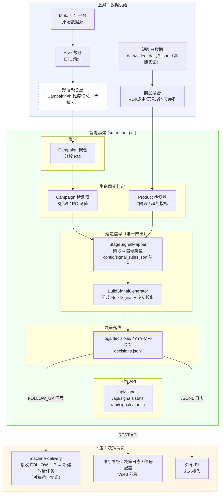
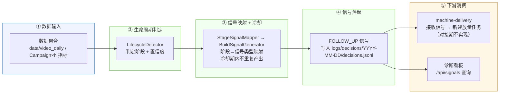
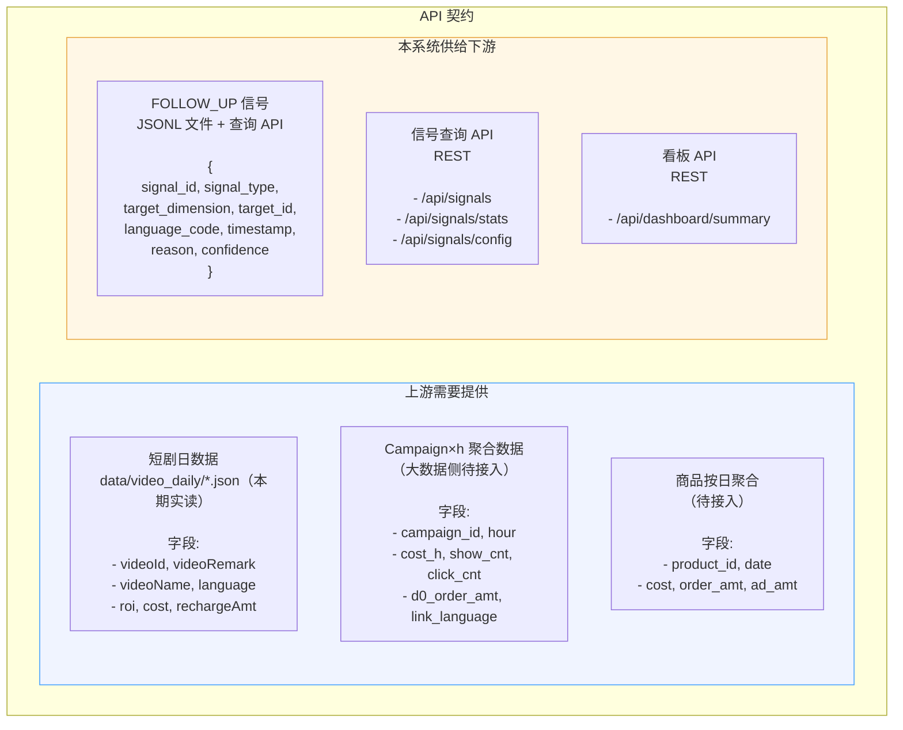

```mermaid
graph TB
    %% ===== 上游 =====
    subgraph upstream["上游：数据供给"]
        meta["Meta 广告平台<br/>原始数据源"]
        hive["Hive 数仓<br/>ETL 清洗"]
        video_daily["短剧日数据<br/>data/video_daily/*.json（本期实读）"]
        data_agg["数据聚合层<br/>Campaign×h 维度汇总（待接入）"]

        meta --> hive
        hive --> data_agg
        video_daily --> prod_agg
    end

    %% ===== 本系统 =====
    subgraph core["智能基建 (smart_ad_put)"]
        direction TB

        subgraph agg["聚合"]
            prod_agg["商品聚合<br/>ROI/成本/语言/近N天序列"]
            cam_agg["Campaign 聚合<br/>分段 ROI"]
        end

        subgraph detect["生命周期判定"]
            cam_detector["Campaign 检测器<br/>8阶段 / ROI阈值"]
            prod_detector["Product 检测器<br/>7阶段 / 趋势指标"]
        end

        subgraph signal["建造信号（唯一产出）"]
            mapper["StageSignalMapper<br/>阶段→信号类型<br/>config/signal_rules.json 注入"]
            generator["BuildSignalGenerator<br/>组装 BuildSignal + 冷却控制"]
        end

        subgraph persist["决策落盘"]
            decision_log["logs/decisions/YYYY-MM-DD/<br/>decisions.jsonl"]
        end

        subgraph dashboard["查询 API"]
            signals_api["/api/signals<br/>/api/signals/stats<br/>/api/signals/config"]
        end

        data_agg --> cam_agg
        cam_agg --> cam_detector
        prod_agg --> prod_detector
        cam_detector --> mapper
        prod_detector --> mapper
        mapper --> generator
        generator --> decision_log
        decision_log --> signals_api
    end

    %% ===== 下游 =====
    subgraph downstream["下游：决策消费"]
        machine_delivery["machine-delivery<br/>接收 FOLLOW_UP → 新建放量任务<br/>（对接期不实现）"]
        frontend["诊断看板 / 决策日志 / 信号配置<br/>Vue3 前端"]
        bi["外部 BI<br/>未来接入"]

        decision_log -->|"FOLLOW_UP 信号"| machine_delivery
        signals_api -->|"REST API"| frontend
        decision_log -->|"JSONL 日志"| bi
    end

    %% ===== 样式 =====
    style upstream fill:#f0f4ff,stroke:#409eff
    style core fill:#f0fff0,stroke:#67c23a
    style downstream fill:#fff7e6,stroke:#e6a23c
    style data_agg fill:#fff,stroke-dasharray:5 5
```

```mermaid
graph LR
    %% ===== 信号链路（时序） =====

    subgraph phase1["① 数据输入"]
        data["数据聚合<br/>data/video_daily / Campaign×h 指标"]
    end

    subgraph phase2["② 生命周期判定"]
        detect_step["LifecycleDetector<br/>判定阶段 + 置信度"]
    end

    subgraph phase3["③ 信号映射 + 冷却"]
        map_step["StageSignalMapper → BuildSignalGenerator<br/>阶段→信号类型映射<br/>冷却期内不重复产出"]
    end

    subgraph phase4["④ 信号落盘"]
        decide_step["FOLLOW_UP 信号<br/>写入 logs/decisions/YYYY-MM-DD/decisions.jsonl"]
    end

    subgraph phase5["⑤ 下游消费"]
        machine["machine-delivery<br/>接收信号 → 新建放量任务<br/>（对接期不实现）"]
        ui["诊断看板<br/>/api/signals 查询"]
    end

    data --> detect_step
    detect_step --> map_step
    map_step --> decide_step
    decide_step --> machine
    decide_step --> ui

    style phase1 fill:#f0f4ff,stroke:#409eff
    style phase2 fill:#f0fff0,stroke:#67c23a
    style phase3 fill:#f0fff0,stroke:#67c23a
    style phase4 fill:#f0fff0,stroke:#67c23a
    style phase5 fill:#fff7e6,stroke:#e6a23c
```

```mermaid
graph TB
    %% ===== 供给契约 =====

    subgraph api_surface["API 契约"]

        subgraph upstream_api["上游需要提供"]
            u1["短剧日数据<br/>data/video_daily/*.json（本期实读）<br/><br/>字段:<br/>- videoId, videoRemark<br/>- videoName, language<br/>- roi, cost, rechargeAmt"]
            u2["Campaign×h 聚合数据<br/>（大数据侧待接入）<br/><br/>字段:<br/>- campaign_id, hour<br/>- cost_h, show_cnt, click_cnt<br/>- d0_order_amt, link_language"]
            u3["商品按日聚合<br/>（待接入）<br/><br/>字段:<br/>- product_id, date<br/>- cost, order_amt, ad_amt"]
        end

        subgraph downstream_api["本系统供给下游"]
            d1["FOLLOW_UP 信号<br/>JSONL 文件 + 查询 API<br/><br/>{<br/>  signal_id, signal_type,<br/>  target_dimension, target_id,<br/>  language_code, timestamp,<br/>  reason, confidence<br/>}"]
            d2["信号查询 API<br/>REST<br/><br/>- /api/signals<br/>- /api/signals/stats<br/>- /api/signals/config"]
            d3["看板 API<br/>REST<br/><br/>- /api/dashboard/summary"]
        end
    end

    style upstream_api fill:#f0f4ff,stroke:#409eff
    style downstream_api fill:#fff7e6,stroke:#e6a23c
```