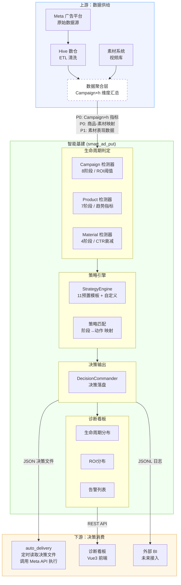
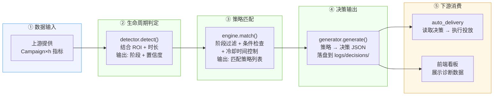
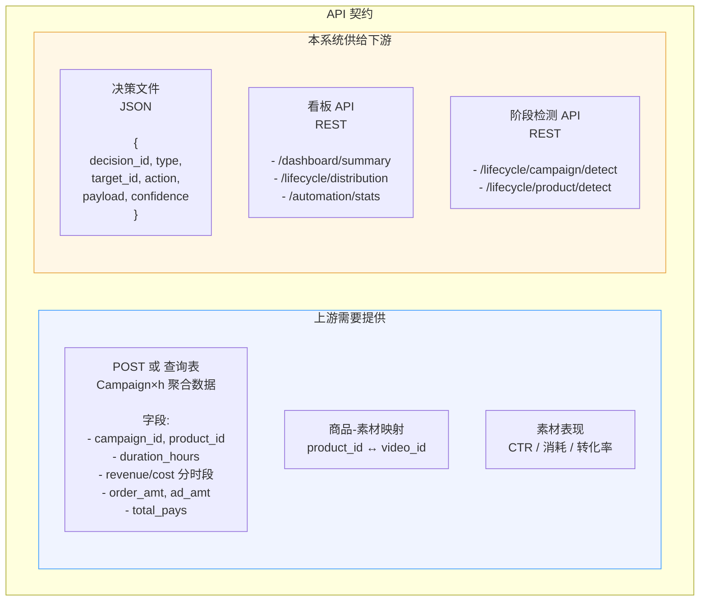

```mermaid
graph TB
    %% ===== 上游 =====
    subgraph upstream["上游：数据供给"]
        meta["Meta 广告平台<br/>原始数据源"]
        hive["Hive 数仓<br/>ETL 清洗"]
        cms["素材系统<br/>视频库"]
        data_agg["数据聚合层<br/>Campaign×h 维度汇总"]

        meta --> hive
        hive --> data_agg
        cms --> data_agg
    end

    %% ===== 本系统 =====
    subgraph core["智能基建 (smart_ad_put)"]
        direction TB

        subgraph detect["生命周期判定"]
            cam_detector["Campaign 检测器<br/>8阶段 / ROI阈值"]
            prod_detector["Product 检测器<br/>7阶段 / 趋势指标"]
            mat_detector["Material 检测器<br/>4阶段 / CTR衰减"]
        end

        subgraph strategy["策略引擎"]
            engine["StrategyEngine<br/>11预置模板 + 自定义"]
            matcher["策略匹配<br/>阶段→动作 映射"]
        end

        subgraph decide["决策输出"]
            commander["DecisionCommander<br/>决策落盘"]
        end

        subgraph dashboard["诊断看板"]
            lifecycle_chart["生命周期分布"]
            roi_chart["ROI分布"]
            alert_list["告警列表"]
        end

        detect --> strategy
        strategy --> decide
        decide --> dashboard
    end

    %% ===== 下游 =====
    subgraph downstream["下游：决策消费"]
        auto_delivery["auto_delivery<br/>定时读取决策文件<br/>调用 Meta API 执行"]
        frontend["诊断看板<br/>Vue3 前端"]
        bi["外部 BI<br/>未来接入"]

        decide -->|"JSON 决策文件"| auto_delivery
        dashboard -->|"REST API"| frontend
        decide -->|"JSONL 日志"| bi
    end

    %% ===== 数据流 =====
    data_agg -->|"P0: Campaign×h 指标<br/>P0: 商品-素材映射<br/>P1: 素材表现数据"| detect

    %% ===== 样式 =====
    style upstream fill:#f0f4ff,stroke:#409eff
    style core fill:#f0fff0,stroke:#67c23a
    style downstream fill:#fff7e6,stroke:#e6a23c
    style data_agg fill:#fff,stroke-dasharray:5 5
```

```mermaid
graph LR
    %% ===== 决策链路（时序） =====

    subgraph phase1["① 数据输入"]
        data["上游提供<br/>Campaign×h 指标"]
    end

    subgraph phase2["② 生命周期判定"]
        detect_step["detector.detect()<br/>结合 ROI + 时长<br/>输出: 阶段 + 置信度"]
    end

    subgraph phase3["③ 策略匹配"]
        match_step["engine.match()<br/>阶段过滤 + 条件检查<br/>+ 冷却时间控制<br/>输出: 匹配策略列表"]
    end

    subgraph phase4["④ 决策输出"]
        decide_step["generator.generate()<br/>策略 → 决策 JSON<br/>落盘到 logs/decisions/"]
    end

    subgraph phase5["⑤ 下游消费"]
        ad["auto_delivery<br/>读取决策 → 执行投放"]
        ui["前端看板<br/>展示诊断数据"]
    end

    data --> detect_step
    detect_step --> match_step
    match_step --> decide_step
    decide_step --> ad
    decide_step --> ui

    style phase1 fill:#f0f4ff,stroke:#409eff
    style phase2 fill:#f0fff0,stroke:#67c23a
    style phase3 fill:#f0fff0,stroke:#67c23a
    style phase4 fill:#f0fff0,stroke:#67c23a
    style phase5 fill:#fff7e6,stroke:#e6a23c
```

```mermaid
graph TB
    %% ===== 供给契约 =====

    subgraph api_surface["API 契约"]

        subgraph upstream_api["上游需要提供"]
            u1["POST 或 查询表<br/>Campaign×h 聚合数据<br/><br/>字段:<br/>- campaign_id, product_id<br/>- duration_hours<br/>- revenue/cost 分时段<br/>- order_amt, ad_amt<br/>- total_pays"]
            u2["商品-素材映射<br/>product_id ↔ video_id"]
            u3["素材表现<br/>CTR / 消耗 / 转化率"]
        end

        subgraph downstream_api["本系统供给下游"]
            d1["决策文件<br/>JSON<br/><br/>{<br/>  decision_id, type,<br/>  target_id, action,<br/>  payload, confidence<br/>}"]
            d2["看板 API<br/>REST<br/><br/>- /dashboard/summary<br/>- /lifecycle/distribution<br/>- /automation/stats"]
            d3["阶段检测 API<br/>REST<br/><br/>- /lifecycle/campaign/detect<br/>- /lifecycle/product/detect"]
        end
    end

    style upstream_api fill:#f0f4ff,stroke:#409eff
    style downstream_api fill:#fff7e6,stroke:#e6a23c
```
