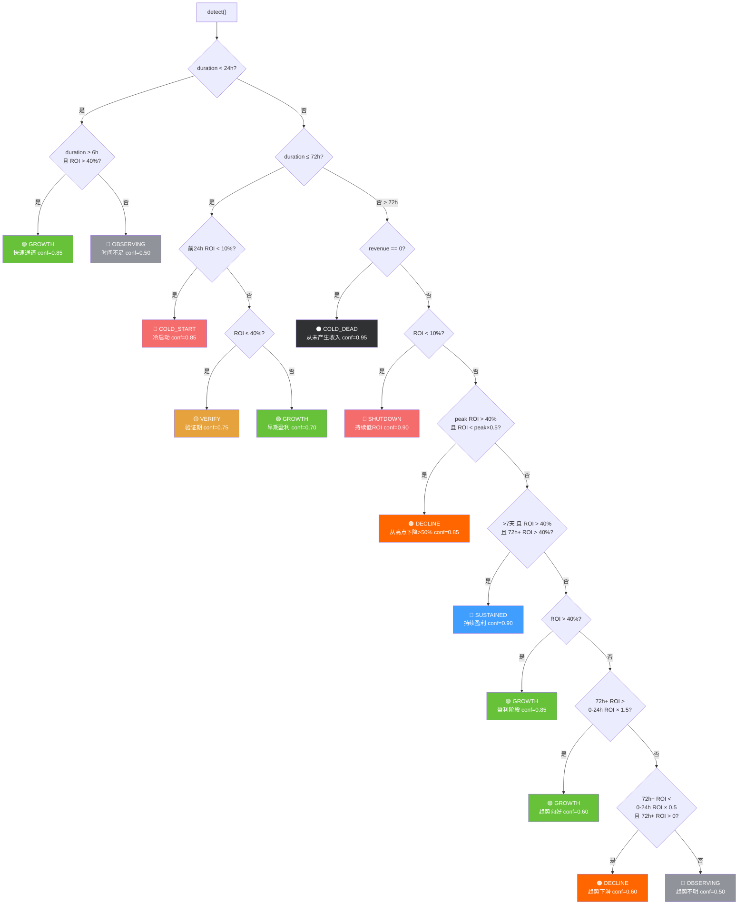
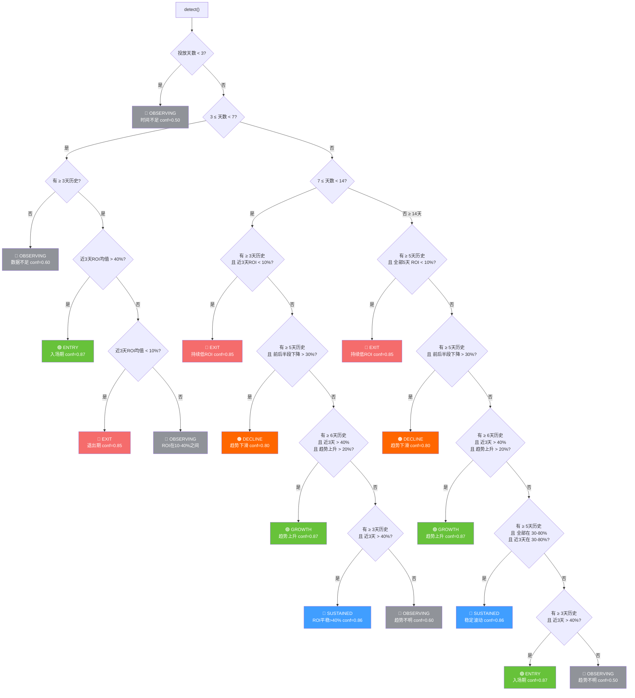

# 生命周期判定决策树

```mermaid
graph TD
    START["detect()"] --> SEG0{"duration &lt; 24h?"}

    SEG0 -->|"是"| FAST{"duration ≥ 6h<br/>且 ROI &gt; 40%?"}
    FAST -->|"是"| C_GROWTH_FAST["🟢 GROWTH<br/>快速通道 conf=0.85"]
    FAST -->|"否"| C_OBS["🔵 OBSERVING<br/>时间不足 conf=0.50"]

    SEG0 -->|"否"| SEG1{"duration ≤ 72h?"}
    SEG1 -->|"是"| S1_C1{"前24h ROI &lt; 10%?"}
    S1_C1 -->|"是"| C_COLD_START["🔴 COLD_START<br/>冷启动 conf=0.85"]
    S1_C1 -->|"否"| S1_C2{"ROI ≤ 40%?"}
    S1_C2 -->|"是"| C_VERIFY["🟡 VERIFY<br/>验证期 conf=0.75"]
    S1_C2 -->|"否"| C_GROWTH_1["🟢 GROWTH<br/>早期盈利 conf=0.70"]

    SEG1 -->|"否 > 72h"| S2_C1{"revenue == 0?"}
    S2_C1 -->|"是"| C_COLD_DEAD["⚫ COLD_DEAD<br/>从未产生收入 conf=0.95"]
    S2_C1 -->|"否"| S2_C2{"ROI &lt; 10%?"}
    S2_C2 -->|"是"| C_SHUTDOWN["🔴 SHUTDOWN<br/>持续低ROI conf=0.90"]
    S2_C2 -->|"否"| S2_C3{"peak ROI &gt; 40%<br/>且 ROI &lt; peak×0.5?"}
    S2_C3 -->|"是"| C_DECLINE_1["🟠 DECLINE<br/>从高点下降>50% conf=0.85"]
    S2_C3 -->|"否"| S2_C4{"&gt;7天 且 ROI &gt; 40%<br/>且 72h+ ROI &gt; 40%?"}
    S2_C4 -->|"是"| C_SUSTAINED["🔵 SUSTAINED<br/>持续盈利 conf=0.90"]
    S2_C4 -->|"否"| S2_C5{"ROI &gt; 40%?"}
    S2_C5 -->|"是"| C_GROWTH_2["🟢 GROWTH<br/>盈利阶段 conf=0.85"]
    S2_C5 -->|"否"| S2_C6{"72h+ ROI &gt;<br/>0-24h ROI × 1.5?"}
    S2_C6 -->|"是"| C_GROWTH_3["🟢 GROWTH<br/>趋势向好 conf=0.60"]
    S2_C6 -->|"否"| S2_C7{"72h+ ROI &lt;<br/>0-24h ROI × 0.5<br/>且 72h+ ROI &gt; 0?"}
    S2_C7 -->|"是"| C_DECLINE_2["🟠 DECLINE<br/>趋势下滑 conf=0.60"]
    S2_C7 -->|"否"| C_OBS_2["🔵 OBSERVING<br/>趋势不明 conf=0.50"]

    style C_GROWTH_FAST fill:#67c23a,color:#fff
    style C_GROWTH_1 fill:#67c23a,color:#fff
    style C_GROWTH_2 fill:#67c23a,color:#fff
    style C_GROWTH_3 fill:#67c23a,color:#fff
    style C_SUSTAINED fill:#409eff,color:#fff
    style C_OBS fill:#909399,color:#fff
    style C_OBS_2 fill:#909399,color:#fff
    style C_COLD_START fill:#f56c6c,color:#fff
    style C_COLD_DEAD fill:#303133,color:#fff
    style C_SHUTDOWN fill:#f56c6c,color:#fff
    style C_VERIFY fill:#e6a23c,color:#fff
    style C_DECLINE_1 fill:#ff6600,color:#fff
    style C_DECLINE_2 fill:#ff6600,color:#fff
```

```mermaid
graph TD
    P_START["detect()"] --> P_C1{"投放天数 &lt; 3?"}
    P_C1 -->|"是"| P_OBS1["🔵 OBSERVING<br/>时间不足 conf=0.50"]

    P_C1 -->|"否"| P_C2{"3 ≤ 天数 &lt; 7?"}
    P_C2 -->|"是"| P3_C1{"有 ≥ 3天历史?"}
    P3_C1 -->|"否"| P_OBS2["🔵 OBSERVING<br/>数据不足 conf=0.60"]
    P3_C1 -->|"是"| P3_C2{"近3天ROI均值 &gt; 40%?"}
    P3_C2 -->|"是"| P_ENTRY1["🟢 ENTRY<br/>入场期 conf=0.87"]
    P3_C2 -->|"否"| P3_C3{"近3天ROI均值 &lt; 10%?"}
    P3_C3 -->|"是"| P_EXIT1["🔴 EXIT<br/>退出期 conf=0.85"]
    P3_C3 -->|"否"| P_OBS3["🔵 OBSERVING<br/>ROI在10-40%之间"]

    P_C2 -->|"否"| P_C3{"7 ≤ 天数 &lt; 14?"}
    P_C3 -->|"是"| P7_C1{"有 ≥ 3天历史<br/>且 近3天ROI &lt; 10%?"}
    P_C3 -->|"否 ≥ 14天"| P14_C1{"有 ≥ 5天历史<br/>且 全部5天 ROI &lt; 10%?"}

    %% 7-14天: _detect_confirming_phase
    P7_C1 -->|"是"| P_EXIT2["🔴 EXIT<br/>持续低ROI conf=0.85"]
    P7_C1 -->|"否"| P7_C2{"有 ≥ 5天历史<br/>且 前后半段下降 &gt; 30%?"}
    P7_C2 -->|"是"| P_DECLINE1["🟠 DECLINE<br/>趋势下滑 conf=0.80"]
    P7_C2 -->|"否"| P7_C3{"有 ≥ 6天历史<br/>且 近3天 &gt; 40%<br/>且 趋势上升 &gt; 20%?"}
    P7_C3 -->|"是"| P_GROWTH1["🟢 GROWTH<br/>趋势上升 conf=0.87"]
    P7_C3 -->|"否"| P7_C4{"有 ≥ 3天历史<br/>且 近3天 &gt; 40%?"}
    P7_C4 -->|"是"| P_SUSTAINED1["🔵 SUSTAINED<br/>ROI平稳>40% conf=0.86"]
    P7_C4 -->|"否"| P_OBS4["🔵 OBSERVING<br/>趋势不明 conf=0.60"]

    %% ≥ 14天: _detect_sustained_phase
    P14_C1 -->|"是"| P_EXIT3["🔴 EXIT<br/>持续低ROI conf=0.85"]
    P14_C1 -->|"否"| P14_C2{"有 ≥ 5天历史<br/>且 前后半段下降 &gt; 30%?"}
    P14_C2 -->|"是"| P_DECLINE2["🟠 DECLINE<br/>趋势下滑 conf=0.80"]
    P14_C2 -->|"否"| P14_C3{"有 ≥ 6天历史<br/>且 近3天 &gt; 40%<br/>且 趋势上升 &gt; 20%?"}
    P14_C3 -->|"是"| P_GROWTH2["🟢 GROWTH<br/>趋势上升 conf=0.87"]
    P14_C3 -->|"否"| P14_C4{"有 ≥ 5天历史<br/>且 全部在 30-80%<br/>且 近3天在 30-80%?"}
    P14_C4 -->|"是"| P_SUSTAINED2["🔵 SUSTAINED<br/>稳定波动 conf=0.86"]
    P14_C4 -->|"否"| P14_C5{"有 ≥ 3天历史<br/>且 近3天 &gt; 40%?"}
    P14_C5 -->|"是"| P_ENTRY2["🟢 ENTRY<br/>入场期 conf=0.87"]
    P14_C5 -->|"否"| P_OBS5["🔵 OBSERVING<br/>趋势不明 conf=0.50"]

    style P_OBS1 fill:#909399,color:#fff
    style P_OBS2 fill:#909399,color:#fff
    style P_OBS3 fill:#909399,color:#fff
    style P_OBS4 fill:#909399,color:#fff
    style P_OBS5 fill:#909399,color:#fff
    style P_ENTRY1 fill:#67c23a,color:#fff
    style P_ENTRY2 fill:#67c23a,color:#fff
    style P_EXIT1 fill:#f56c6c,color:#fff
    style P_EXIT2 fill:#f56c6c,color:#fff
    style P_EXIT3 fill:#f56c6c,color:#fff
    style P_DECLINE1 fill:#ff6600,color:#fff
    style P_DECLINE2 fill:#ff6600,color:#fff
    style P_GROWTH1 fill:#67c23a,color:#fff
    style P_GROWTH2 fill:#67c23a,color:#fff
    style P_SUSTAINED1 fill:#409eff,color:#fff
    style P_SUSTAINED2 fill:#409eff,color:#fff
```
